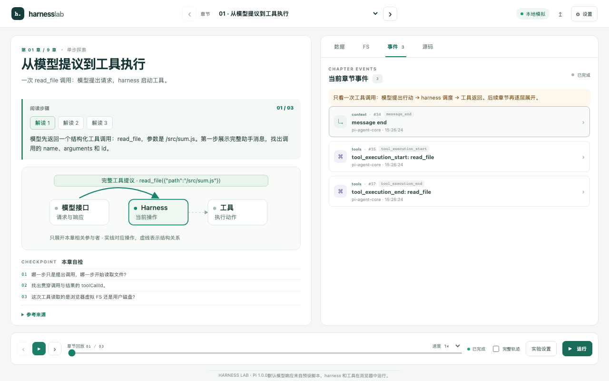
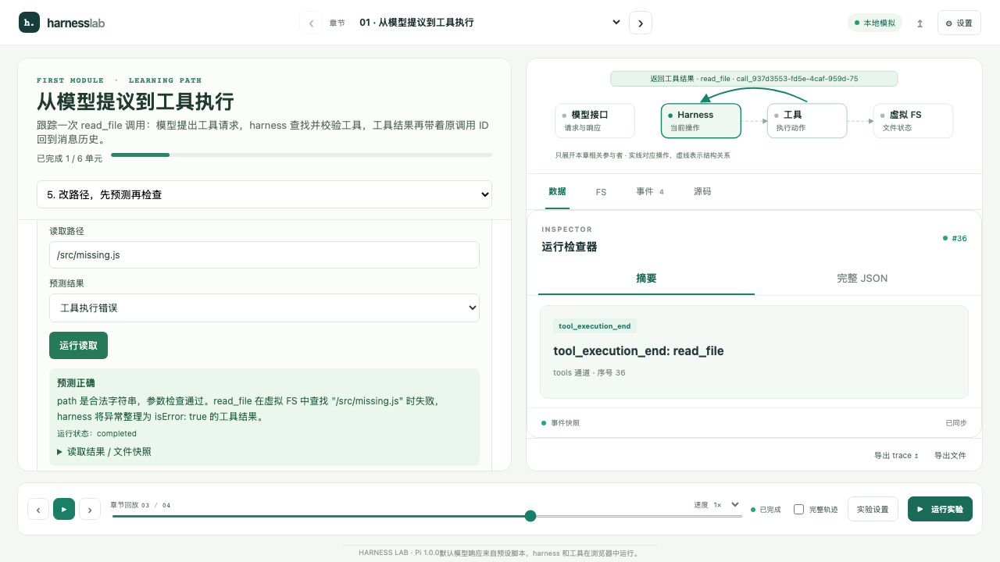
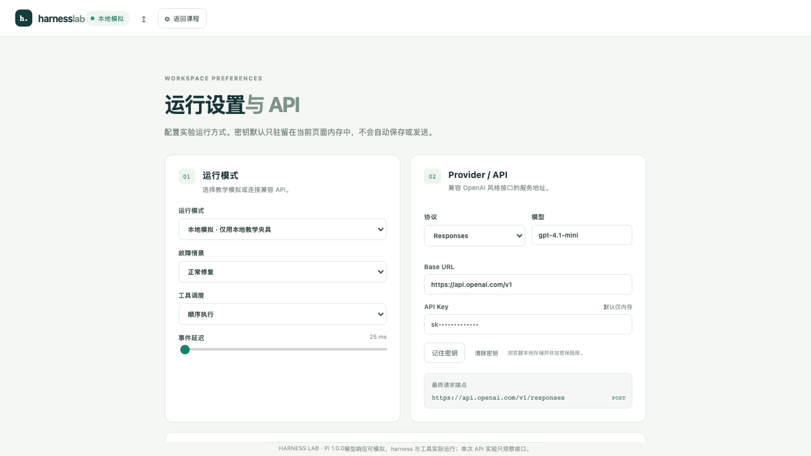

# Harness Lab

一个纯静态的中文 Agent harness 学习网站。第一模块提供六个学习单元：目标与前置知识、调用字段、源码讲解、结果回填、读取练习和测验。左侧阅读教材，右侧跟随当前单元查看事件、文件和源码。其余八章目前保留简版说明，等待样板反馈后扩写。

默认响应来自浏览器内的模拟 provider；Pi harness、provider adapter、工具校验和教学测试均实际运行。默认模式不需要 API key，也不发送远程请求。自由探索时可改用自己的兼容 API。



## 本地运行

需要 Node.js 22.19 或更新版本（Pi 依赖要求）。

```sh
npm ci
npm run dev
```

终端显示本地 URL。不要通过 `file://` 打开构建文件，模块 Worker 需要 HTTP(S) origin。

```sh
npm run check
npm test
npm run build
npx playwright install chromium
npm run test:e2e
```

`dist/` 是静态部署产物，使用相对资源路径。部署后无需 Node 服务或模型代理。模拟运行需要先加载静态资源，未实现首次离线访问的 Service Worker 缓存。

## Cloudflare Pages

Cloudflare Pages 构建设置：
- 构建命令：`npm run build`
- 输出目录：`dist`
- Node.js：22.19 或更新版本
- 无 Pages Functions、无后台代理、无服务器密钥环境变量。

模型设置由访问者在浏览器填写。本站章节切换不使用客户端 URL 路由，无需自定义重写规则。部署后须通过实际 Pages origin 验证第三方 API 的 CORS。

## 章节版式预览

部署后的 `/design/learning-layouts.html` 提供三页独立预览：请求字段拆解、执行步骤、文件前后对比。它使用采集的 Pi 运行数据，控件放在对应例子附近，正文和代码保持固定字号。现有课程暂不替换，先确认各类内容的呈现方式。

## 第一模块样板

1. 工具调用的完整过程：学习目标、前置知识和六单元路线。
2. 读取模型的工具提议：逐项解释 `id`、`name`、`arguments`，配 JSON 示例。
3. 查找、校验、执行：结合固定 Pi revision 的连续源码说明处理顺序。
4. 结果回填：追踪 `toolCallId`、结果消息与下一轮请求。
5. 改路径做预测：输入存在、缺失或空路径，选择预测，再用真实 Pi 执行验证。
6. 测验与总结：三题都有答案解析和复习入口；答错可以修改后重试。

普通阅读单元由学习者标记完成，读取预测正确和三题全对后自动记录对应单元。完成进度和最近学习单元保存在此浏览器，刷新后可以继续。练习是只读操作，始终使用本地模拟 provider，与用户的实时 API 配置分开。



## 其他机制与实验

- 后续章节分别聚焦请求转换、流式解析、单次工具生命周期、循环边界和文件快照。完整修复流程仍保留在可主动开启的实验视图中。
- 本轮模型请求与本地历史的区别。
- Chat Completions / Responses 请求格式与流式事件。
- 工具参数校验、执行错误、取消及下一轮循环。
- 文件快照与会话历史的生命周期。
- 上游 session/compaction 机制的源码说明。它们不等同于本站已实现的持久化/压缩实验。

选择事件可查看当时的数据和文件快照。时间轴回退切换查看位置，运行后的工作区保持原状态。点击“运行实验”进入完整轨迹视图；课程示例和读取练习各自保存事件与快照。

## 设置与 API 实验室



配置 base URL、model、协议与 API key。单次 API 实验支持 SSE / 非流式 JSON、实际请求预览和响应观测；它不执行工具。完整 agent 使用 Pi 的流式 adapter，并把每轮工具结果重新提交给模型。

模拟 provider 覆盖正常修复、无效工具参数、provider 错误和真实失败测试。它只处理这些教学场景，不支持任意任务；其他请求会明确失败。用量和延迟为模拟设定。

真实 API：
- 必须主动点击并确认费用与发送内容，不在页面打开时请求。
- API endpoint 必须允许浏览器 CORS。应用不会绕过 CORS 或静默转发到其他服务。
- 密钥默认仅页面内存；“记住”显式写入浏览器本地存储，非加密保险库。
- key / authorization 不进入公开事件或 trace 导出；工作区与 trace 含用户内容，只有主动操作才保存或导出。
- 停止尝试取消请求，不保证已计费调用或已发生效果被撤回。

## 执行边界

虚拟文件系统只在浏览器中运行，不读写用户磁盘。教学执行器是受限算术解释器，只接受形如 `export function sum(a, b) { return a + b; }` 的函数，支持 `+ - * /` 运算符。执行器不调用 eval，也不支持完整 JavaScript；Worker 隔离并可终止执行，但不构成通用安全沙箱。

本版不含 Python、通用终端、MCP、多 agent 执行器或上游 coding-agent session 恢复；相关章节分别说明上游源码机制和本站功能。

## 参照与证据

运行依赖固定为 `@earendil-works/pi-agent-core@1.0.0` 和 `@earendil-works/pi-ai@1.0.0`，公布的 gitHead：`a13d35a742c6ef8462812a28fbe1d8c8b7431c32`。

- [源码与接口证据](evidence/REFERENCE.md)
- [第三方说明](THIRD_PARTY_NOTICES.md)
- `src/lib/runtime.test.ts`：实际 Pi loop 与工具链路。
- `src/lib/transport.test.ts`：协议解析、观测、URL 和授权边界。
- `src/lib/api-lab.test.ts`：两种非流式格式与单次实验。
- `src/lib/read-exercise.test.ts` / `learning-runtime.test.ts`：两种协议的只读练习、反馈与单元事件对应。
- `tests/first-module.spec.ts`：预测、空路径校验、测验重试及刷新恢复。
- `tests/`：实际 Chromium 交互、错误、取消、导出及窄屏验收。

自动化验证使用本地模拟 provider，尚未实测第三方服务的 CORS、兼容性或真实模型调用。
